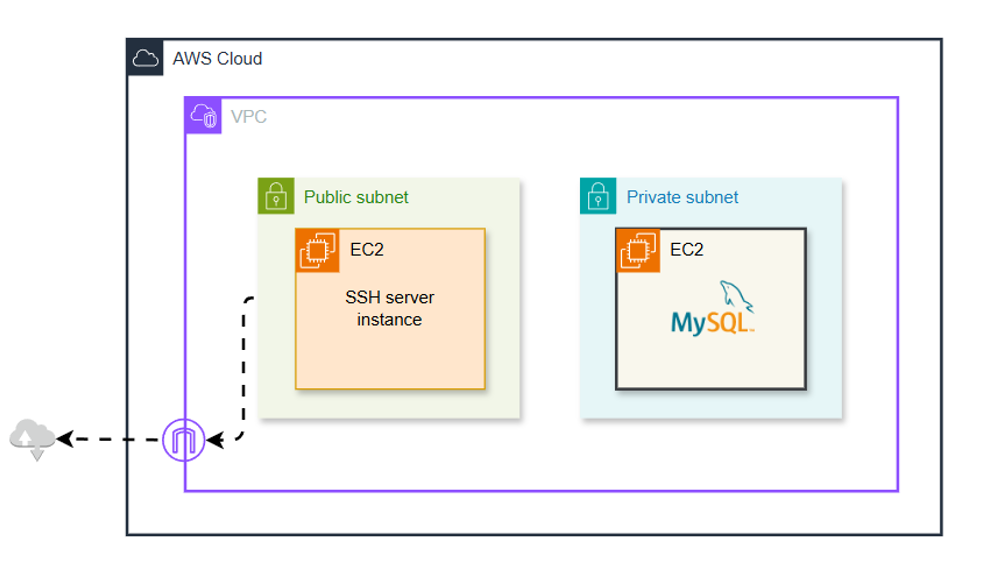

# SSH Local Port Forwarding 

## 📌 **Project Overview**
This project sets up secure SSH local port forwarding to enable access to a MySQL server hosted in a private subnet through a bastion host in AWS. The infrastructure is created using **Pulumi**.

---

## Architecture


## 🚀 **Architecture Overview**
- **Bastion Host**:
  - Launched in a **public subnet**.
  - Acts as a secure entry point for SSH connections.

- **MySQL Server**:
  - Hosted in a **private subnet**.
  - Cannot be accessed directly from the internet.
  - Configured with a **NAT Gateway** for outbound traffic.

### **Flow Summary**
1. A network engineer connects to the bastion host using SSH.
2. SSH local port forwarding is established.
3. Traffic from the engineer's local machine (port 3306) is securely forwarded to the MySQL server's port 3306 through the bastion host.

---

## 🔎 **What is SSH Tunnel Port Forwarding?**
SSH port forwarding (also called SSH tunneling) creates an encrypted tunnel between a local machine and a remote server over the SSH protocol. It allows you to securely forward traffic from a local port to a remote service through an intermediate server.

---

## 🔎 **What is Local Port Forwarding?**
Local port forwarding allows forwarding a port from your local machine to a remote server through an SSH connection.
- In this project:
  - Local machine’s **port 3306** is forwarded to the MySQL server’s **port 3306**.
  - Traffic flows through the bastion host, creating a secure connection between the local machine and the private MySQL server.

---

## 🛠 **Setup and Usage**

### **1️⃣ Prerequisites**
- AWS CLI installed and configured.
- Pulumi installed.
- SSH client installed on the local machine.
- Access to the AWS environment.

### **2️⃣ Deploy Infrastructure with Pulumi**
```sh
pulumi up
```
This command will create the required AWS resources, including the bastion host and MySQL server.

### **3️⃣ Establish SSH Tunnel**
To manually set up the SSH local port forwarding:
```sh
ssh -L 3306:<private-mysql-ip>:3306 -N -f -i <bastion-key.pem> ec2-user@<bastion-host-ip>
```
- `-L`: Specifies the local and remote ports.
- `-N`: Prevents execution of remote commands.
- `-f`: Runs SSH in the background.

---

## 📜 **Automating the SSH Tunnel**
To keep the SSH tunnel open persistently, we have created a script called **`ssh_tunnel_local.sh`** and a **systemd** service to automatically start the tunnel after boot.

### **1️⃣ SSH Tunnel Script (`ssh_tunnel_local.sh`)**
```sh
#!/bin/bash

LOGFILE="/var/log/ssh_port_forward.log"
NOW="$(date +%d/%m/%Y' - '%H:%M)" 

REMOTEHOST="ubuntu"
REMOTEHOSTIP="18.136.118.1"
REMOTELOCALIP="10.0.2.81"

SSH_REMOTEPORT=3306
SSH_LOCALPORT=3306

createTunnel() {
    /usr/bin/ssh -f -N -i /root/code/aws-pulumi-infra/key-pair-poridhi-poc.pem -L $SSH_LOCALPORT:$REMOTELOCALIP:$SSH_REMOTEPORT $REMOTEHOST@$REMOTEHOSTIP
    
    if [[ $? -eq 0 ]]; then
        echo "[$NOW] Tunnel to $REMOTEHOST created successfully" >> $LOGFILE
    else
        echo "[$NOW] An error occurred creating a tunnel to $REMOTEHOST. RC was $?" >> $LOGFILE
    fi
}

createTunnel
```
- Make the script executable:
  ```sh
  chmod +x ssh_tunnel_local.sh
  ```

### **2️⃣ Systemd Service (`ssh-tunnel.service`)**
Create a systemd service file at `/etc/systemd/system/ssh-tunnel.service`:
```ini
[Unit]
Description=SSH Tunnel Service
After=network.target
StartLimitIntervalSec=0

[Service]
Type=oneshot
ExecStart=/usr/local/bin/ssh_tunnel_local.sh
RemainAfterExit=yes
Restart=on-failure
RestartSec=5
User=root

[Install]
WantedBy=multi-user.target
```
- Enable and start the service:
  ```sh
  sudo systemctl enable ssh-tunnel
  sudo systemctl start ssh-tunnel
  ```

---

## 🎯 **Verification**
- Check the SSH tunnel:
  ```sh
  netstat -tulnp | grep 3306
  ps ax | grep ssh
  ```
- Test MySQL connection:
  ```sh
  mysql -h 127.0.0.1 -P 3306 -u <mysql-user> -p
  ```

---

## 🏗 **Infrastructure Cleanup**
To remove the deployed infrastructure:
```sh
pulumi destroy
```

---

## 📄 **License**
This project is licensed under the MIT License.

---


